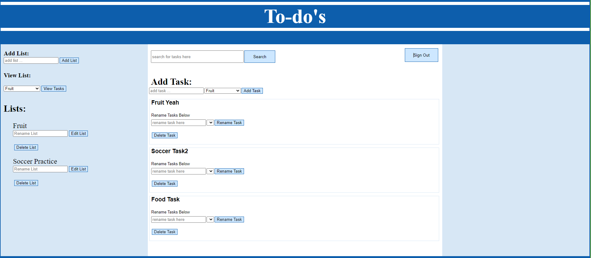
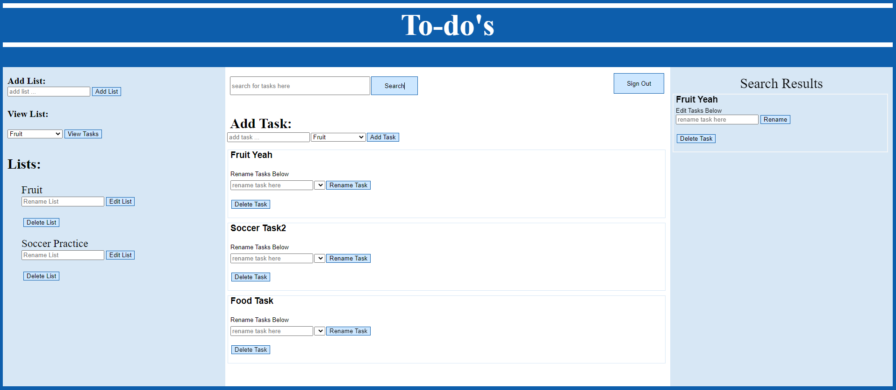

# MemberTheMilk

Remember The Milk (MVP Clone). 
MemberTheMilk is inspired by RememberTheMilk a to-do list task tracker.

# Live Site
https://rememberthismilk.herokuapp.com/

# Features

Logged in users can:

* Add/Create Tasks
* Update/Delete Tasks
* Add/Create Lists
* Update/Delete Lists
* Able to view a summary of their selected List
* Able to search for matched (case sensitive) Tasks 

# How to start the development enviornment

* Clone this repository: git clone `git@github.com:JacobDChamberlain/MemberTheMilk.git`
* Install dependencies: `npm install`
* Create a .env file based on the .env.example given
* Setup your username and database based on what you wrote for your .env
* Migrate and Seed Models by running:
  * `npx dotenv sequelize db:migrate`
  * `npx dotenv sequelize db:seed:all`
* Start the app using: `npm start`

# Technologies Used:

* Git
* Javascript
* NodeJS
* Sequelize
* Pug
* Express
* Heroku
* CSS
* bcryptjs
* Postgresql

# Create, Read, Update and Delete Tasks

# List Summary

# Search Feature

# Database Schema

# Wiki Docs
https://github.com/JacobDChamberlain/MemberTheMilk/wiki